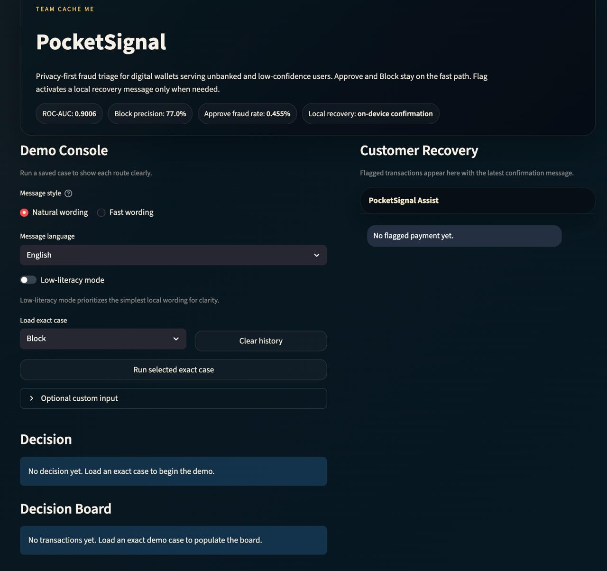
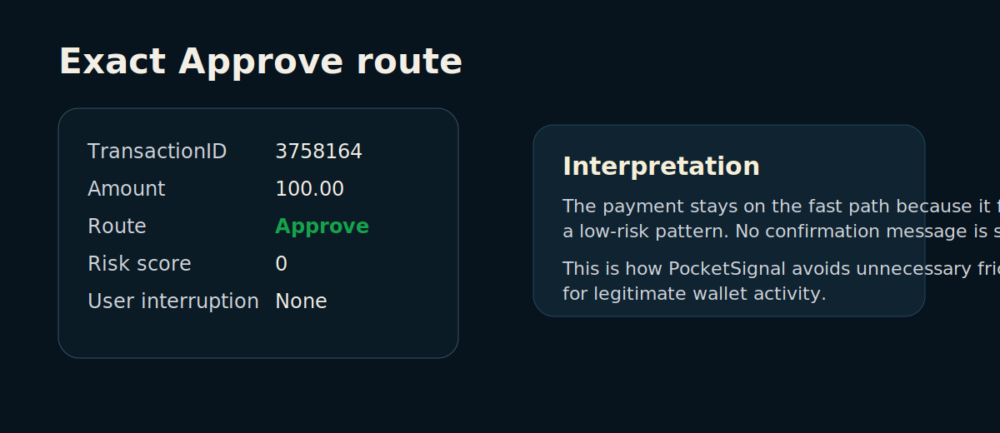
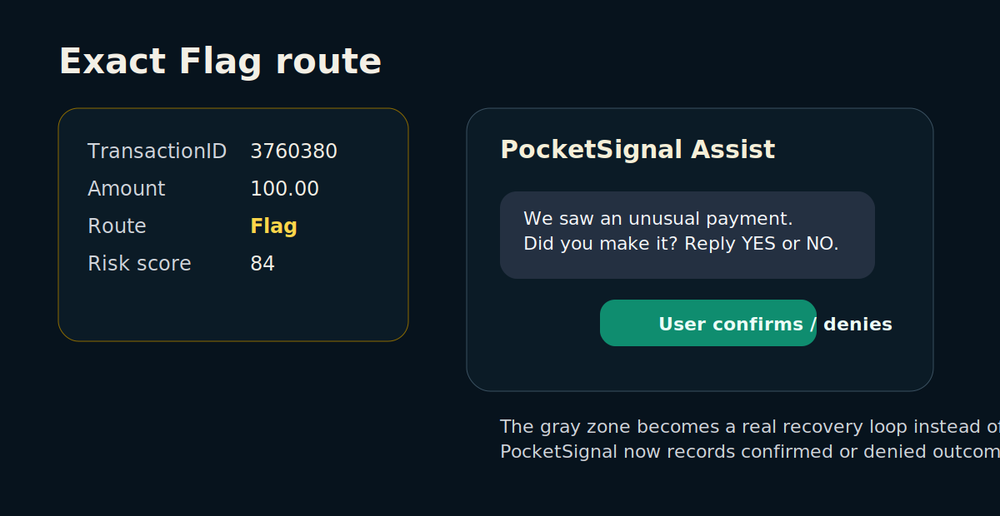
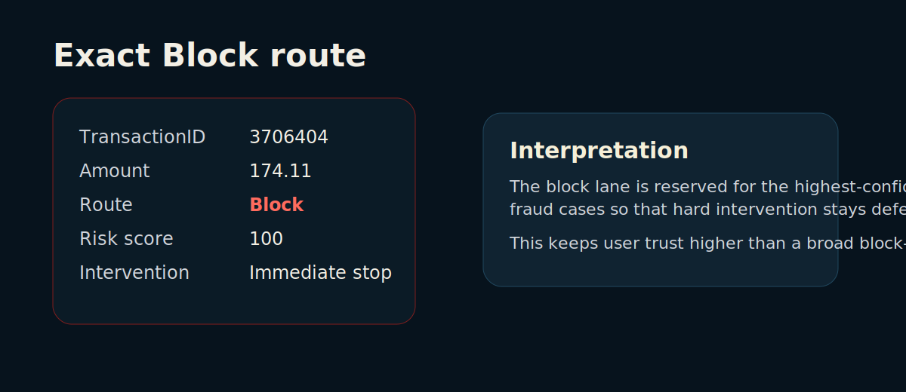
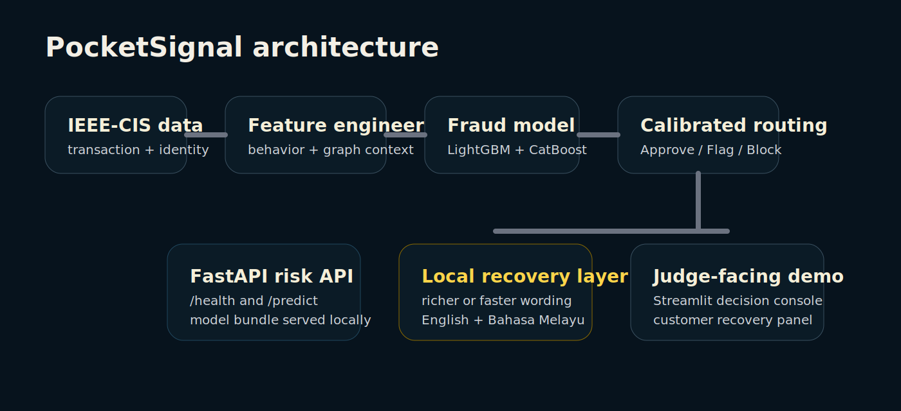

# PocketSignal

PocketSignal is Team Cache Me's V-HACK 2026 prototype for Case Study 2: **Digital Trust – Real-Time Fraud Shield for the Unbanked**.

It is a privacy-first fraud triage layer for digital wallets and QR-payment ecosystems.
Instead of returning only a fraud score, PocketSignal turns each transaction into one of three actions:
- `Approve` for low-risk activity
- `Flag` for the gray zone that needs user confirmation
- `Block` for the highest-confidence fraud lane

The main idea is simple: **detect risk, choose the right intervention, and communicate it in a way the user can act on.**

## Product walkthrough



This overview shows the three calibrated routes. Only the gray-zone `Flag` route activates a recovery step.

### Exact `Approve` route



The `Approve` lane keeps legitimate transactions on the fast path with no unnecessary interruption.

### Exact `Flag` route



The `Flag` lane now supports a real closed loop: the user can confirm or deny the payment, and the dashboard records the outcome instead of showing a fake static reply.

### Exact `Block` route



The `Block` lane is intentionally narrow so hard intervention is reserved for the highest-confidence fraud cases.

## Architecture



PocketSignal combines three layers of value:
1. behavior-aware and graph-aware fraud scoring
2. calibrated `Approve / Flag / Block` routing
3. local recovery wording only for the gray zone

## Current validation evidence

From the current full-data validation run:
- `ROC-AUC`: `0.9006`
- `PR-AUC`: `0.5007`
- `Block precision`: `77.0%`
- `Block false-positive rate`: `0.3569%`
- `Approve-bucket fraud rate`: `0.4552%`

Current calibrated route mix on the validation split:
- `Approve`: `73,817` (`62.5%`)
- `Flag`: `42,519` (`36.0%`)
- `Block`: `1,772` (`1.5%`)

This route mix is materially more operational than the earlier conservative version that pushed too much traffic into the gray zone.
Not every `Flag` becomes manual review: the current recovery loop can resolve part of the gray zone directly through user confirmation or denial.

## Key technical choices

### 1. Behavioral profiling
PocketSignal engineers leak-safe historical behavior features such as:
- past transaction count
- past average amount
- time-derived patterns

### 2. Context-aware graph features
PocketSignal also models relationships such as:
- `card1 -> DeviceInfo`
- `card1 -> P_emaildomain`

This helps surface suspicious shared infrastructure without moving to a heavier graph-neural deployment stack.

### 3. Calibrated triage instead of a raw score
PocketSignal does not expose only a raw fraud probability.
It calibrates the score, then maps it into a route that a wallet operator can actually act on.

### 4. Local recovery wording
Only `Flag` transactions trigger recovery wording.
Two local modes are supported:
- **Richer local wording** (`response_profile=judge_demo`): uses Ollama when available for a more natural recovery message
- **Faster local wording** (`response_profile=fast_route`): uses deterministic local wording for tighter latency

Richer local wording is not trusted blindly. PocketSignal validates the generated text and falls back to the local template if the output is unreliable or poorly localized.

### 5. Real low-literacy support
Low-literacy mode now changes the wording itself instead of only truncating text.
For clarity and consistency, this mode prioritizes the simplest deterministic local wording rather than free-form generation.
Example low-literacy wording:
- English: `We saw an unusual payment. Did you make it? Reply YES or NO.`
- Bahasa Melayu: `Kami nampak transaksi luar biasa. Adakah anda yang membuat transaksi ini? Balas YA atau TIDAK.`

## Repository structure

- `src/payung/`: PocketSignal's internal Python package name. It remains `payung` for model-bundle compatibility, but the public product name is PocketSignal.
- `config.yaml`: centralized data, model, routing, and LLM configuration
- `src/payung/preprocess.py`: data merge + engineered features + feature store
- `src/payung/modeling.py`: training, calibration, threshold optimization, evaluation
- `src/payung/inference.py`: online inference and explanation routing
- `src/payung/llm.py`: local wording helpers and Ollama client
- `apps/fastapi_app.py`: `/health` and `/predict` endpoints
- `apps/dashboard.py`: judge-facing dashboard with exact demo path and customer recovery panel
- `scripts/`: training, ablation, demo-case generation, latency testing, and sample prediction helpers
- `reports/`: generated metrics, ablation, latency, and demo-case artifacts
- `docs/`: business, ethics, and case-study alignment notes

## Included reproducibility artifacts

This public repo includes the files needed to run the prototype without retraining first:
- `artifacts/model_bundle.pkl`
- `reports/metrics.json`
- `reports/demo_cases.json`
- `reports/latency_judge_demo.md`
- `reports/latency_fast_route.md`
- `reports/latency_submission_summary.md`

The raw Kaggle CSV files are intentionally **not** redistributed here.

## Quick start

### 1. Install dependencies

macOS / Linux:
```bash
python3 -m pip install -r requirements.txt
```

Windows PowerShell:
```powershell
py -3 -m pip install -r requirements.txt
```

### 2. Optional preprocessing run

macOS / Linux:
```bash
python3 scripts/preprocess.py --sample-frac 0.10
```

Windows PowerShell:
```powershell
py -3 scripts/preprocess.py --sample-frac 0.10
```

### 3. Train and export the model bundle

macOS / Linux:
```bash
python3 scripts/train.py --sample-frac 0.10
```

Windows PowerShell:
```powershell
py -3 scripts/train.py --sample-frac 0.10
```

If your environment has OpenMP issues, use safe mode:
```bash
python3 scripts/train.py --sample-frac 0.10 --safe-mode
```

### 4. Optional ablation run
```bash
python3 scripts/run_ablation.py --sample-frac 0.05
```

### 5. Install Ollama for natural local wording mode
```bash
ollama pull llama3
```

Before recording or demoing, check the exact local model tag:
```bash
ollama list
```

If your machine does not have a model named exactly `llama3`, set the backend model tag explicitly to match your local Ollama installation. Example:
```bash
POCKETSIGNAL_OLLAMA_MODEL=llama3.1:8b
```

Lighter local natural-wording benchmarks for future work:
- `ollama pull llama3.2:1b`
- `ollama pull qwen2.5:1.5b`

### 6. Start the FastAPI backend

macOS / Linux:
```bash
PYTHONPATH=src uvicorn apps.fastapi_app:app --host 0.0.0.0 --port 8000
```

Useful demo-time environment options:
```bash
POCKETSIGNAL_RESPONSE_PROFILE=fast_route
POCKETSIGNAL_OLLAMA_KEEP_ALIVE=10m
POCKETSIGNAL_OLLAMA_PRELOAD=1
POCKETSIGNAL_OLLAMA_TIMEOUT=8
POCKETSIGNAL_OLLAMA_MODEL=llama3
```

Windows PowerShell:
```powershell
$env:PYTHONPATH="src"
$env:POCKETSIGNAL_OLLAMA_TIMEOUT="8"
$env:POCKETSIGNAL_OLLAMA_MODEL="llama3"
py -3 -m uvicorn apps.fastapi_app:app --host 0.0.0.0 --port 8000
```

### 7. Start the Streamlit dashboard

macOS / Linux:
```bash
streamlit run apps/dashboard.py
```

Windows PowerShell:
```powershell
py -3 -m streamlit run apps/dashboard.py
```

### 8. Generate the exact demo cases
```bash
python3 scripts/find_demo_cases.py --sample-frac 0.02
```

### 9. Run latency evidence
```bash
python3 scripts/load_test.py --scenario mixed_exact --requests 60 --concurrency 3 --timeout 10 --response-profile judge_demo --output reports/latency_judge_demo.md
python3 scripts/load_test.py --scenario mixed_exact --requests 60 --concurrency 3 --timeout 10 --response-profile fast_route --output reports/latency_fast_route.md
```

## Demo path used in judging

For the live demo, use the exact saved cases in this order:
1. `Approve`
2. `Flag`
3. `Block`

For the `Flag` case, the dashboard now supports an explicit user-response loop:
- user confirms
- or user denies and triggers a blocked / manual-review outcome

That makes the recovery flow visible instead of leaving it as a static message bubble.

## API contract

`POST /predict`
- input: transaction feature JSON (`TransactionAmt`, `card1`, `DeviceInfo`, ...)
- optional fields:
  - `preferred_language`: `English | Bahasa Melayu`
  - `response_profile`: natural local wording (`judge_demo`) or fast local wording (`fast_route`)
  - `low_literacy`: `true | false`
- output:
  - `status`: `Approve | Flag | Block`
  - `risk_score`: integer `0-100`
  - `probability`: calibrated fraud probability
  - `top_features`: human-readable risk reasons
  - `explanation`: local recovery or route explanation
  - `latency_ms`
  - `model_version`

`GET /health`
- `model_loaded`
- `ollama_ready`
- `feature_store_ready`

## Key evidence files

- `reports/metrics_report.md`
- `reports/metrics.json`
- `reports/leakage_check.md`
- `reports/ablation_report.md`
- `reports/latency_judge_demo.md`
- `reports/latency_fast_route.md`
- `reports/latency_submission_summary.md`
- `docs/case_study2_compliance.md`
- `docs/privacy_and_ethics.md`
- `docs/business/market_and_impact.md`

## References

See [references.md](references.md) for the external sources used in the public-facing documentation.
